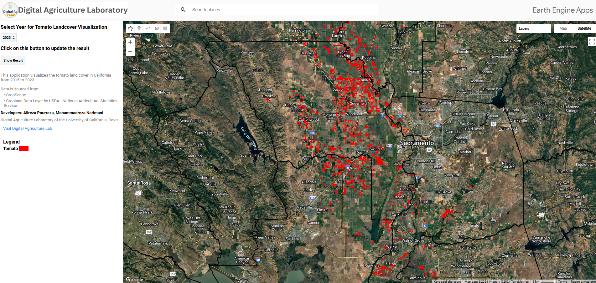

# Tomato Landcover Visualization Portal for California

## Overview
This repository contains the Google Earth Engine (GEE) script for the **Tomato Landcover Visualization Portal**, developed by the Digital Agriculture Laboratory at the University of California, Davis. This tool enables dynamic visualization and analysis of tomato crop distribution across California from 2015 to 2023.

### Key Features
- **Interactive Mapping:** Users can select different years to visualize the distribution of tomato landcover.
- **Geographical Boundaries:** The visualization includes both county and state boundaries, providing detailed geographical context.
- **Dynamic Legend and Information Panel:** Information updates dynamically based on user selection to enhance understanding and interaction.
- **User-friendly Interface:** Designed with a focus on usability to aid researchers, educators, and policymakers.

## Data Source
This application utilizes the **Cropland Data Layer (CDL)** provided by the USDA - National Agricultural Statistics Service. It specifically extracts tomato-related data using a custom script that identifies tomato crops using specific codes in the dataset.

## Setup and Usage
To use this application:
1. Access the Google Earth Engine (GEE) platform.
2. Clone this repository into your GEE environment using the following URL:
   ```
   https://code.earthengine.google.com/?accept_repo=users/mnarimani/TomatoLandcoverVisualizationPortalForCalifornia
   ```
3. Navigate to the `scripts` section and open the `TomatoLandcoverVisualization` script.
4. Select the desired year from the dropdown menu and click the 'Show Result' button to update the map visualization.

### Initial View
The map is initially centered over Davis, California, providing a focused starting point for exploration.

## Visualization
The visualization employs a red palette (`#FF0000`) to represent tomato crops, which stands out against the default hybrid map background for clarity. State and county boundaries are delineated with bold lines, ensuring they are visible even when zoomed out.

## Live Application
Explore the live application here: [Tomato Landcover Viewer](https://ee-mnarimani.projects.earthengine.app/view/catomatolandcoverviewer)

## Developer
- **Mohammadreza Narimani**

### Contact
For more information or inquiries, reach out via email at [mnarimani@ucdavis.edu](mailto:mnarimani@ucdavis.edu).

## Digital Agriculture Laboratory
For more information about other projects or collaborations, visit our lab's website:
[Digital Agriculture Lab at UC Davis](https://digitalag.ucdavis.edu/)


